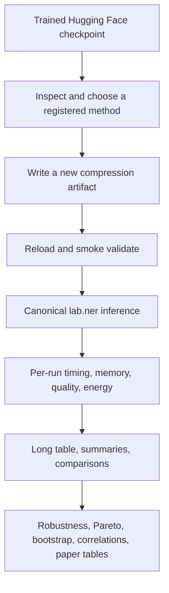

# Transformer compression and controlled studies

This is the documentation entry point for `lab.ner.quantisation`. The source-package README is at
[`src/lab/ner/quantisation/README.md`](../../../src/lab/ner/quantisation/README.md).

## Workflow



The package never treats parameter count, serialized bytes, CPU/GPU memory, FLOPs, latency, or
energy as interchangeable. Each has to be measured independently.

## Read by task

1. [Install and use every CLI command](cli.md).
2. [Understand the implementation](system-architecture.md).
3. [Write compression and experiment YAML](configuration.md).
4. [Understand artifacts and manifests](artifacts.md), then [validate them](validation.md).
5. [Run and resume controlled experiments](experiments.md).
6. [Interpret timing, memory, throughput, and CodeCarbon](measurements.md).
7. [Run post-hoc scientific analysis](analysis.md) or [Entity Linking experiments](entity-linking.md).
8. Choose a family from the [method index](methods/README.md).
9. Follow the [tutorials](tutorials/README.md), use the [cheat sheet](CLI_CHEATSHEET.md), or consult
   [troubleshooting](troubleshooting.md) and the [glossary](glossary.md).
10. Contributors should read [extending the module](extending.md).

## Installation

```bash
uv pip install -e ".[ner]"
# Add NEL/FAISS/cross-encoder dependencies when needed:
uv pip install -e ".[all]"
```

The executable is `lab`, from `lab.cli:main`. Run `lab quantisation --help`. `quantization` is an
alias only at the central CLI group level; documentation uses the source spelling, `quantisation`.

## Existing focused pages

The earlier focused notes remain useful and are linked—not duplicated—from the method index:
[precision](precision.md), [quantization](quantization.md), [pruning](pruning.md),
[architecture/distillation](architecture.md), [runtime/low-rank](runtime.md), and
[references](references.md). The detailed controlled-methodology page is
[benchmarking.md](benchmarking.md).
