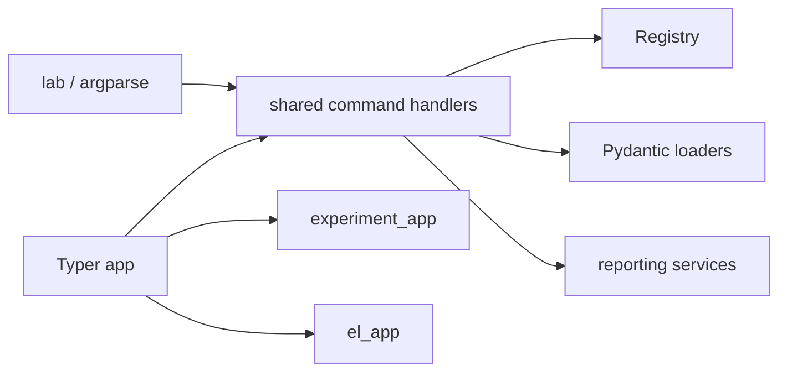
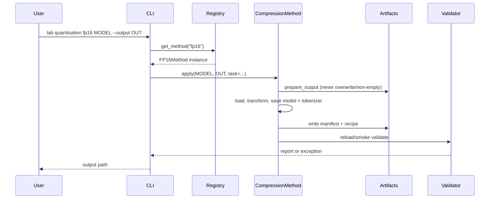
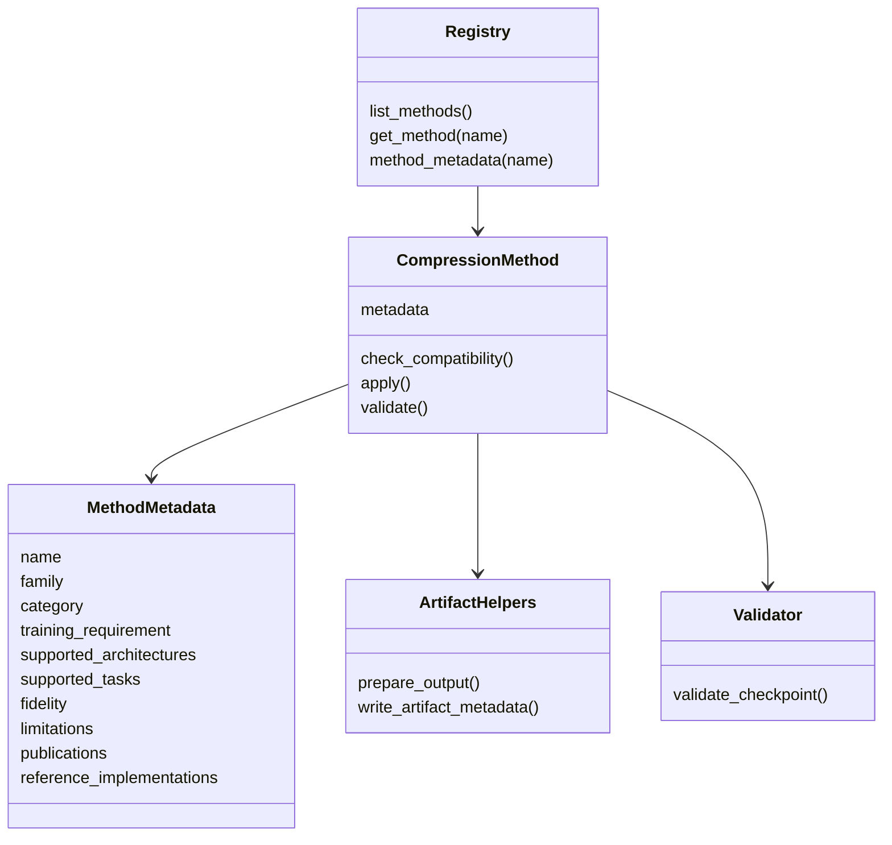
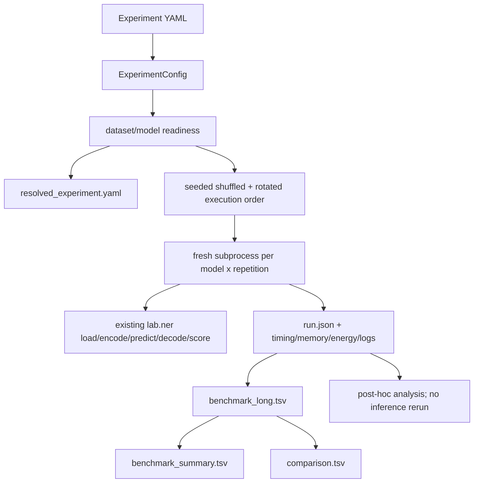

# Architecture and internal execution

[Home](README.md) · [CLI](cli.md) · [Extension guide](extending.md)

## Two CLI surfaces, one set of handlers

The installed `lab` command is an `argparse` application in `lab.cli`. During parser construction it
lazily imports `lab.ner.quantisation.cli` and calls `add_parser`; this preserves repository layering.
That module also creates an embeddable Typer application:

```python
app = typer.Typer(...)
experiment_app = typer.Typer(...)
el_app = typer.Typer(...)
app.add_typer(experiment_app, name="experiment")
app.add_typer(el_app, name="el")
```

Decorated functions such as `@app.command("fp16")` and
`@experiment_app.command("run")` call ordinary handler functions. The central parser calls those
same handlers through `_dispatch`. Consequently compression logic is not duplicated in either CLI
surface.

The implementation uses Python type annotations for Typer arguments/options. It uses
`typer.Option(...)` only to make `compare-predictions --model` required. It does **not** use
`Annotated`, callbacks, `Context`, Typer enums, or Typer path existence validators. Pydantic—not
Typer—validates YAML. Central CLI errors are described in [CLI exit behavior](cli.md#exit-and-error-behavior).



## Compression execution



`CompressionMethod.__call__` offers a compatibility-check wrapper, but current CLI handlers call
`method.apply()` directly. Current concrete classes generally perform their own input checks; the
base `check_compatibility()` default returns no errors. Therefore `methods` metadata is guidance,
not an automatic checkpoint-specific capability report.

## Registry relationships



The FP32 baseline is metadata only. Registry keys and command names differ for dynamic INT8:
registry `int8-dynamic`, command `int8`.

## Experiment execution



The parent runner does not include process startup in forward timing. Each worker writes `RUNNING`
before loading and a terminal result on success/error. It deletes references, runs garbage
collection, synchronizes CUDA, and empties the CUDA cache in `finally`.

## NER integration

The worker composes existing `lab.ner.inference` functions: `load_model`, `read_documents`, saved
encoder construction, `predict_logits`, `decode_spans`, and standard span writers. Strict scoring
uses existing `lab.ner.evaluation.scoring.span_metrics`. Specialized INT8/SVD loading is selected
from `compression_manifest.json`; normal artifacts follow the stock linear/CRF loader.

## Entity Linking integration

The EL adapter imports existing `lab.nel.linking` and `EntityLinkingPipeline` lazily, then uses its
span/gazetteer readers, candidate-generator factory, `_generate`, optional `_rerank`, and existing
retrieval metrics. Some retrievers combine mention encoding and search in one API call; the result
records that combined timing scope and leaves inseparable fields empty rather than inventing times.
See [Entity Linking](entity-linking.md).
